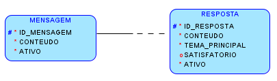
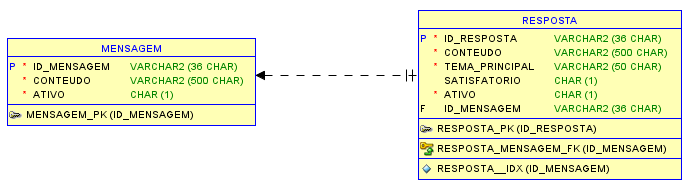

# SOA WebServices — Challenge Sprint 1

## Descrição do Projeto
Este projeto faz parte da Sprint de Arquitetura Orientada a Serviços (SOA) e Web Services, com foco no desenvolvimento de uma API modular, escalável e interoperável.

A aplicação segue os princípios de RESTful Web Services, possui arquitetura em camadas e integra banco de dados, documentação e boas práticas de segurança.

## Tecnologias Utilizadas
- Java 17+
- Spring Boot
- Spring Web
- Spring Data JPA
- MySQL / PostgreSQL
- Maven
- Swagger / OpenAPI
- JSON / XML
- Princípios de SOA

## Arquitetura (SOA)
O sistema foi organizado utilizando uma estrutura orientada a serviços, garantindo baixo acoplamento e alta coesão entre os componentes.

A arquitetura é dividida entre:
- Controller:
    - Camada responsável por receber requisições e retornar respostas.

- Service:
    - Camada onde ficam as regras de negócio.

- Repository:
    - Responsável pela comunicação com o banco de dados.

- Model:
    - Estruturas de dados e entidades utilizadas na aplicação.

Essa separação assegura:
- Facilidade de manutenção
- Modularidade
- Reutilização de serviços
- Interoperabilidade entre diferentes sistemas

## Web Services Implementados
A API utiliza o padrão REST e foi construída com métodos HTTP adequados:
- GET — leitura de dados
- POST — criação de novos registros
- PUT — atualização
- DELETE — remoção

Inclui também um endpoint de verificação de saúde do serviço (Health Check), garantindo monitoramento e estabilidade.

(As rotas podem variar conforme o microserviço implementado.)

## Segurança
Práticas essenciais de segurança para Web Services aplicadas:
- Validação de entrada para evitar ataques
- Tratamento adequado de erros e exceções
- Respostas padronizadas
- Uso de práticas que previnem SQL Injection
- Não exposição de detalhes sensíveis em respostas ou logs

## Interoperabilidade e Escalabilidade
A API foi projetada para:
- Comunicar-se com qualquer plataforma (Java, Python, JavaScript etc.)
- Utilizar padrões universais (JSON/XML)
- Crescer com facilidade através de novos módulos e serviços
- Ser integrada a sistemas externos sem necessidade de alterações profundas

## Conexão com Banco de Dados
O projeto inclui:
- Configuração completa de conexão com banco relacional
- Entidades mapeadas
- Repositórios utilizando JPA
- Migrações e criação automática de estruturas conforme necessário

Essa integração é fundamental para persistência de dados e funcionamento dos serviços.
### Modelo Conceitual

### Modelo Lógico

## Health Check
Há um endpoint dedicado para indicar o funcionamento da API, permitindo monitoramento rápido e confiável do serviço.
- http://localhost:8080/health-check (padrão)

## Documentação da API
A documentação de Endpoints da API é gerada automaticamente via Swagger/OpenAPI.
- http://localhost:8080/swagger (padrão)

Recursos disponíveis na documentação:
- Visualização das rotas
- Descrição dos parâmetros
- Modelos de entrada e saída
- Testes diretos na interface